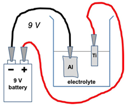
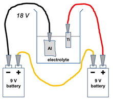
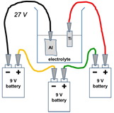

钛阳极氧化
===========================

### **介绍**

当一层二氧化钛出现在钛金属表面上时，光照射在表面会散射使其看起来是五颜六色的。我们能看见的颜色取决于二氧化钛颜色的厚度。

在这个实验中我们将会对一些钛金属做‘阳极化处理’，用来创造出一层二氧化钛膜，并用改变电压的方式来控制厚度，以此来获得不同的颜色。

### **设备**

钛金属条（3-4cm长，1cm宽）

4 x 鳄鱼夹

酸性电解质 例如稀磷酸或者醋酸，或者尝试可乐或者醋！

250mL烧杯

铝箔

纸巾

3 x 9V电池 或 变压电源

镊子

### 安全

在整个实验过程中配戴手套。**请不要串联3个以上的电池以免发生危险。**如果你使用的是变压电源，不要用30V以上的电压。

### **方法**

 1.在烧杯中倒入100mL的电解质溶液

2.剪一片略长于钛金属条的铝箔

3.如图所示，用鳄鱼夹连接电池/电压源的**负极**和**铝箔**

4.将铝箔放入烧杯，确保它完全在电解质液面以下

*使用9V电压*

5.如果你使用的是变压电源，将电压调至9V

6.将电源/电池**正极**与钛条连接起来

7.用镊子夹住金属，将钛条放入电解质中。**注意不要让钛和铝接触。**在电解质溶液中保持30s的时间。

8.将钛条取出，用**纸巾**擦去电解质溶液，观察此时是什么颜色？

*使用18V电压*

9.如果你使用的是变压电源，将电压调至18V

10.为了获取更高的电压，我们将两节电池用鳄鱼夹串联在一起，如图所示

11.用鳄鱼夹将第二节电池的**正极**和钛金属条连接在一起

12.将钛金属条放入电解液中，**注意不要让钛和铝接触。**在电解质溶液中保持30s的时间。

13. 将钛条取出，用**纸巾**擦去电解质溶液，观察此时是什么颜色？

*使用27V电压*

14.如果你使用的是变压电源，将电压调至27V

15.如果你使用的是电池，按照如图所示的方法连接电池

16.将钛金属条浸入电解质溶液30s

17. 将钛条取出，用**纸巾**擦去电解质溶液，与前两块做对比

### **问题**

-如果将电池的负极与钛相连、正极和铝相连会发生什么？

-尝试不同的反应时间，它们会造成什么不同？

-尝试使用不同的电解质和强酸进行试验，它们会让实验效果更好吗？

 

### **清理**

将电解质倒入水池并用大量水冲洗。金属铝和金属钛可以扔进垃圾桶。

## 教师笔记

### **化学背景知识**

阳极氧化是一个用来在金属上镀上氧化保护层的电化学过程。铝是这个过程最常用的金属，但是像钛一样的其他金属也可以被阳极氧化。

 

钛在电化学环路中作为阳极。氧气会从酸性电解质的阳极产生，并与金属反应增厚其氧化层。电压越高，氧化层越厚。

 

颜色的产生是一个‘结构染色’的例子:不同于分子染料，这里的颜色来自阳光在氧化层的散射。一些光在氧化层发生反射，另一些到达金属表面再被反射。如果两束反射光**同相**，则会发生干涉，这样氧化的钛金属条就会呈现颜色。破坏了干涉就不会出现颜色的变化。

 

具体呈现什么颜色取决于二氧化钛层的厚度。对于一个给定的厚度，某些波长将会被干涉加强，而另一些会干涉相消。因此特定的电压值（也就是特定的二氧化钛厚度）就会有特定的颜色。

 

在很高的电压下，整个颜色范围都是可能的，但是出于安全原因，这个实验被限制在高达30V的范围内。

 

厚度为d的颜色和厚度为2d的颜色相同。

 

在自然环境下，金属表面会形成一层天然的氧化钛层，但通过电化学方法可以获得更厚的氧化钛层。不同的颜色生产方法通常用于艺术品、珠宝和牙科植入物。

 

*与太阳能的联系*

纳米晶体的二氧化钛用于在染料敏化太阳能电池（DSSC）中的一个电极上充当半导体。这种形式的二氧化钛是白色的，不吸收可见光，因此用吸光的有色染料与之结合，使其能够用于太阳能电池。

 

二氧化钛薄膜可以被添加到某些太阳能电池中（如DSSC），作为“光散射层”，以增加光的收集，并且提高效率。

### **实验过程中**

在一块钛上产生彩色条纹是可行的。当使用最低电压设置的时候（如一块电池），将钛完全放入酸液中。将钛露出液面半厘米并加以更高的电压。重复这个过程，就可以得到厚度逐渐升高的金属条，从而得到不同颜色的条纹。

 

### **变化与拓展**

-尝试使用不同的电解质，比较最好的效果——如：比较汽水或者醋。电解质必须包含氧气

-做一个不插电仅浸泡的实验以观察颜色是否受到影响

-用金属抛光剂（如Brasso）清洁钛，用肥皂水清洗，然后在阳极氧化前用丙酮和乙醇冲洗。这会影响结果吗？钛金属在暴露于空气中时会轻微氧化，因此在阳极氧化前对其进行清洁可能会产生更均匀和可重复的结果。

 

### **课程连接**

-光散射

-电力和电路

-阳极氧化

-氧化还原反应

-电化学电池

 

### **安全**

下面是一些在这个实验中使用的化学品的一般安全信息。有关更多详细信息，请参阅相应的危险警告卡

 

磷酸

-吞咽的紧急情况：就医；如沾染到皮肤用肥皂和大量清水清洗；如溅到眼睛中用大量清水清洗5分钟以上并就医。

-佩戴防护眼镜，在通风良好的区域进行试验

-少量的稀磷酸可被冲下水槽