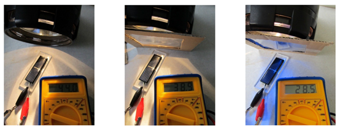

太阳能电池和吸收
===========================

**介绍**

​		这项活动证明了太阳能电池能够吸收不同波长的太阳能电磁频谱并显示其吸收的能力越强，生产的能量越多。

**设备**

​		-太阳能电池 

​		-光或手电筒 

​		-万用表/电流表 

​		-醋酸纤维——一种透明三种带颜色：蓝色，红色和绿色

**方法**

​    	将太阳能电池连接到万用表并测量电压和电流。

​		打开灯，看看电压和电流如何变化。

​		现在，将透明的醋酸盐放在光源和太阳能电池之间。读数是否改变？

​		重复使用有色乙酸盐和一种以上乙酸盐的组合。

​		如果将所有四种乙酸盐放在光源和太阳能电池之间，太阳能电池是否还在产生读数？

**到底是怎么回事？**

​		太阳能电池主要吸收可见光，但也将吸收一小部分红外线和紫外线区域。当将透明的醋酸盐放在光源和太阳能电池之间时，它会在到达电池之前吸收紫外线，并且太阳能电池产生的电流会略有减少。使用有色的醋酸盐会更大地减小电流，因为它们吸收了一些可见光能量，然后才落在电池上。

​		如果将所有四种乙酸酯都挡住，由于少量入射光以其他角度入射，并且太阳能电池也吸收了一些红外线，因此仍然会有一些电流。

**实验器材清单**

​		-0.5V单晶硅太阳能电池板

​		-亚克力板（将太阳能电池板粘在上面以保护连接）

​		-LED，电池组，蜂鸣器，电动机等

​		-鳄鱼夹引线

​		-万用表

​		-醋酸纤维板过滤器（透明，红色，蓝色，绿色）

​		-小电筒

也尝试：

​		-柔性PV电池（薄膜无定形硅）

​		-“法拉第薄膜”（导电塑料）

​		-电子纺织品套件

​		-太阳能手电筒

**注意**：LED手电筒不适合此实验。与白炽灯不同，LED灯利用的太阳光谱非常狭窄，因此光功率输出实际非常低。甚至“白色”LED光也需经过调节才能使其适宜于人眼。大多数LED不能产生足够的辐射来为电池板供电。这可以很好的说明LED灯的工作原理以及LED与白炽灯的区别，也可以进一步说明太阳光谱涵盖相对较大波长范围这一事实。