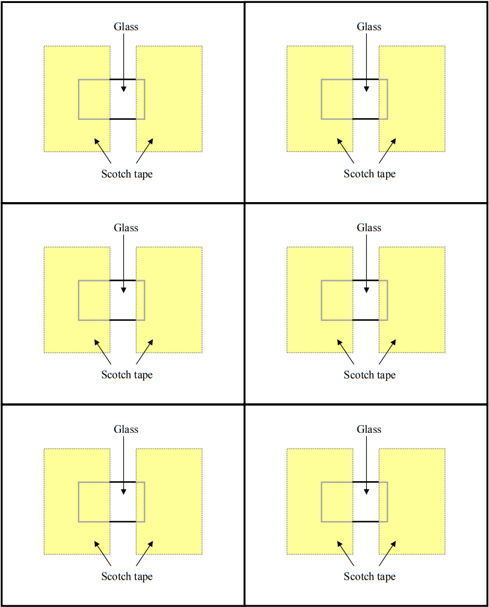

Grätzel电池
===========================

## 样板

## 风险评估

| 隐患                    | 损伤的可能性和严重性   | 管控措施                                                     | 采取措施后的损伤隐患 |
| ----------------------- | ---------------------- | ------------------------------------------------------------ | -------------------- |
| 处理玻璃仪器            | 可能，严重损伤可能性小 | 讲解可能发生的割伤的风险。                                   | 低                   |
| 使用温度高达100°C的电炉 | 可能，严重损伤可能性小 | 讲解烧伤的风险。确保使用镊子去除高温器件。 确保不使用电炉时将其关闭，并将不必要的物品保持在安全距离外。 | 中                   |
| 使用化学药品            | 可能，严重损伤可能性小 | 始终佩戴护目镜。 小心处理。 参阅其他风险评估表。             | 低                   |