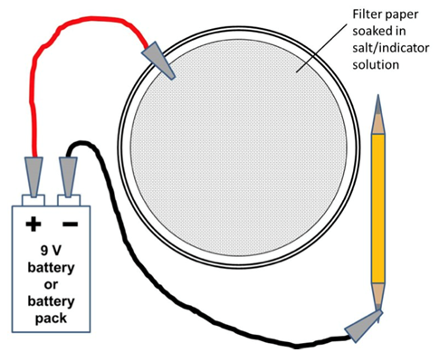

电化学书写
===========================

### **介绍**

​		一个太阳能电池包含两个电极。每一个电极上发生不同的反应，因此电子可以在回路中移动，从而产生电。在这个实验中，我们可以看到这些反应的作用和正确组建电池的重要性。

### **设备**

小烧杯

盐（NaCl）

刮勺

水

指示剂（例如，通用指示剂、酚酞、甲基橙）

2 x 移液管

滤纸

浅培养皿（如培养皿）

电池组或9V电池

电线和鳄鱼夹

碳电极：两端削尖的铅笔

### **方法**

 1将1勺盐溶解在2-3毫升水中，配制少量盐溶液

2添加衰减指示器的耦合器

3 把滤纸放在盘子里

4用移液管把盐溶液滴到滤纸上，直到它不能再吸收为止。不要把滤纸浸透了！

5使用导线和鳄鱼夹将蓄电池或蓄电池组的正极连接到滤纸上。

6将负极连接到碳电极（铅笔）的一端。确保金属夹与铅笔的石墨芯接触。

7用碳素电极在滤纸上轻轻书写。

8你应该看到电极与纸张接触时的颜色变化。

9如果你把电池接反了会发生什么？

### **清理**

​		可以在水槽中清洗所有的设备。含盐的溶液都可以在水槽中清洗。滤纸扔进垃圾桶。

## 电化学书写实验器材清单

### 器材/组

-盐（NaCl）

-水

-9V电池或电池组（3V或6V）

-电线和鳄鱼夹

-滤纸

-培养皿或其他浅培养皿或平板

-两端削尖的铅笔或碳电极（可从铅笔获得，见下文）

-指示剂，例如通用指示剂、酚酞、甲基橙

-刮刀

-移液管

-小烧杯

### 介绍

制作碳电极：

-甲基化酒精

-HB铅笔（末端无橡皮擦）

-箔

-火柴

-隔热垫

-旧的浅钢罐或金属盘，如旧的金枪鱼罐。

-镊子/钳子

**安全/火灾风险：如果铝箔开始燃烧，这种方法会产生一些烟雾，从而触发烟雾警报。不要使用太多的甲基化酒精，并确保所有易燃物品和溶剂处于安全距离。你可以在户外做这个实验。**

1用箔纸包住铅笔。

2将5-10ml甲基化酒精倒入罐头或碟子中放置

在隔热垫上

3 把包好的铅笔放在罐子的边缘（见图片）。

4用火柴点燃甲基化酒精

5保持燃烧直到燃料耗尽火焰熄灭。

6让它冷却。

7打开铝箔，从碳化层中取出石墨芯

8把石墨分成适当的长度用作碳电极

### **器材可以在哪里买到**

-甲基化酒精可以从五金店买到

### **废液处理**

滤纸可以扔进垃圾桶，所有器材都可以用清水在水槽中清洗。

## 教师笔记

### **背景知识**

当碳电极连接到电池的负极时，它起到阴极的作用。氯化钠溶液中含有钠离子、氯离子和水。当电路完成时，一些水将离解形成H+和OH-离子。由于H+离子的标准还原电位小于Na+离子的标准还原电位，H+离子优先获得电子形成氢气。留在溶液中的OH-离子是碱性的，因此在碳电极接触滤纸的地方可以看到pH指示剂颜色的变化。

当碳电极以另一种方式连接到正极时，它起到阳极的作用，并将氯离子吸引到它身上。这些离子失去一个电子，形成氯原子，而氯原子不能形成碱性溶液，因此看不到颜色变化。

### ***与太阳能的联系\***

太阳能电池使用两个电极，一个发生氧化，一个发生还原。在这里，电池提供的能量导致氧化和还原反应，但在太阳能电池中，太阳的能量导致这种情况发生，以便创造电流和发电。在激子太阳能电池中，太阳在工作电极上氧化光吸收聚合物或染料。

### **实验过程**

如果铅笔的石墨芯内部断裂，电路中可能会有间隙（但是这不太可能，因为它应该仍然非常紧凑，所以石墨片之间至少应该有一些接触）。如果第一次实验不成功，可以试着用另一支铅笔。

可以提取铅笔的石墨芯，并将其用作碳电极。这应该由老师在上课前做。该程序的详细信息见设备清单。

酚酞比通用指示剂的效果更好，因为中性或酸性时该指示剂是无色的，所以只有在碱性出现时才能看到颜色。

### **变化与拓展**

-用不同的指示剂并观察颜色的变化

### **课程连接**

-电极和电化学电池

-酸和碱

-电气和电路

-氧化还原

### **安全**

下面是一些在这个实验中使用的化学品的一般安全信息。有关更多详细信息，请参阅相应的危险警告卡。

**通用指示剂**

-如不慎吞咽，不要催吐，请就医；如沾染到皮肤上，用大量清水冲洗；如不慎溅到眼睛，用大量的水冲洗。

-如果是纯乙醇，要作为高度易燃物质对待

-防护戴安全眼镜。

-用大量的水冲洗水槽。 

**酚酞指示剂**

-如不慎吞咽，不要催吐，请就医；如沾染到皮肤上，用大量清水冲洗；如不慎溅到眼睛，用大量的水冲洗。

-防护戴安全眼镜。

-用大量的水冲洗水槽。

 

### **参考**

参考RSC经典化学实验手册中的实验。