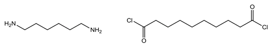
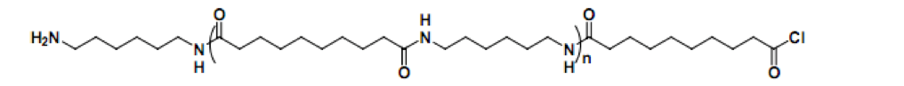

缩聚
===========================

### **介绍**

​		在这个实验中，你将合成尼-610。尼龙是一种聚合物，由两种母体单体聚合而二，一种二胺和一种二元酸氯化物。

### **设备**

-10 mL己二胺溶液（0.5 M，水溶液，添加NaOH）

-10 mL癸二酰氯溶液（0.25 M，己烷溶液）

-100毫升烧杯

-镊子

-绕线设备

-尼龙废容器

### **方法**

 -将水溶液、己二胺和氢氧化钠水溶液倒入烧杯中。小心地将癸二酰氯溶液倒在上面，倾斜烧杯，从侧面倒下去，不要搅拌或混合。

-尼龙形成的界面在两相之间清晰可见，这是尼龙聚合物形成的地方。

-使用镊子，抓住溶液界面处的聚合物膜并将其取出，小心不要让尼龙线接触烧杯的侧面。尼龙线可以被快速的绕在绕线设备上。

-剩余的单体可以用镊子混合形成尼龙滴

### **溶液中发生了什么？**

这两种单体不混合，因为其中一种溶液是水溶液，另一种是有机溶液。然而，在它们接触的界面上会发生反应。胺基和酰氯基发生反应，形成具有以下结构的长链聚合物。反应的另一个产物是HCl，因为二胺中失去了氢离子，二氯化氢反应时失去了氯离子。聚合物形成于界面，是一种固体，因为它是一个大分子。

当一些尼龙从烧杯中抽出时，更多的单体分子与之接触，因此它们可以反应形成聚合物，这使尼龙线保持连续。

### **与太阳能的联系**

合成聚合物被应用在聚合太阳能电池上。

### **废液处理**

将所有反应产生的废物放入尼龙废物容器；不要将任何东西放进下水道。一定要把烧杯洗干净，不要在侧面留下任何尼龙残留物。

### **安全**

佩戴手套。在混合两种溶液时，会产生HCl，所以会看到液面上方出现蒸汽。在接触尼龙前请用清水将其冲干净。